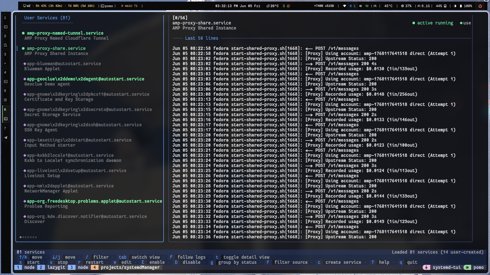

# Systemd TUI Manager

A terminal UI for managing `systemd --user` services. Split-pane layout, vim-style navigation, mouse support, live log following.




## Features

- Start, stop, restart, enable, disable user services
- Create new services from a built-in modal
- Three detail views per service: live logs, full `systemctl status`, unit config
- Live log following with bounded buffering
- Filter modes: all / my services / hide system
- Grouping: by status (active/failed/inactive) or by load state
- Source-aware indicators distinguishing user (●), system (○), transient (◌), generated (◆), static (◇)
- Mouse: click to select rows, click to switch panes, scroll wheel in detail pane
- Themes: Catppuccin Mocha (default), Dark, Light, High-Contrast — terminal background shows through panel borders for a native feel

## Install

```bash
git clone https://github.com/Snehit70/systemdManager
cd systemdManager
go build -o systemd-tui ./cmd/systemd-tui
sudo mv systemd-tui /usr/local/bin/   # optional
```

## Run

```bash
./systemd-tui
```

## Keybindings

| Key | Action |
|---|---|
| `j/k` or `↑/↓` | Navigate list |
| `tab` | Switch focus between list and detail |
| `/` | Filter services by name |
| `s` | Start |
| `x` | Stop (confirm) |
| `r` | Restart (confirm) |
| `e` | Edit unit file in `$EDITOR` |
| `E` | Enable (confirm) |
| `D` | Disable (confirm) |
| `c` | Create new service |
| `f` | Toggle follow logs |
| `g` | Cycle grouping (none / status / load) |
| `F` | Cycle source filter (all / my services / hide system) |
| `t` | Cycle detail view (logs / status / config) |
| `[` / `]` | Shrink / grow list pane |
| `?` | Toggle help |
| `q` / `ctrl+c` | Quit |

### Create service modal

| Key | Action |
|---|---|
| `tab` / `shift+tab` | Next / previous field |
| `t` | Cycle service type (simple / oneshot) |
| `r` | Cycle restart policy (on-failure / always / no) |
| `enter` | Create |
| `esc` | Cancel |

The new unit file is written to `~/.config/systemd/user/` and `daemon-reload` runs automatically.

## Configuration

Config file: `~/.config/systemd-tui/config.yaml` (created on first run).

```yaml
general:
  refresh_interval: 2s     # poll cadence (1s–60s)
  log_lines: 50            # one-shot log length
  max_follow_lines: 1000   # follow-mode buffer cap
  editor: ""               # falls back to $EDITOR, then vim

ui:
  theme: mocha             # mocha | dark | light | high-contrast
  reduce_motion: false
  show_hidden: false
```

## Requirements

- Linux with systemd
- `systemctl` and `journalctl` on `PATH`
- Go 1.25+ (to build)

## Development

```bash
go test ./...
go build -ldflags="-s -w" -o systemd-tui ./cmd/systemd-tui
```

## Architecture

- **Bubble Tea** for the Elm-style update loop
- **`internal/client`** defines the `ServiceClient` interface; `internal/service` provides the systemctl-backed implementation
- **`internal/ui`** holds the model, view, and styles
- **`internal/config`** holds YAML loading and theme palettes

See [`docs/IMPLEMENTATION.md`](./docs/IMPLEMENTATION.md) for current implementation reference, palette, and the rest of the design notes.

## License

MIT
